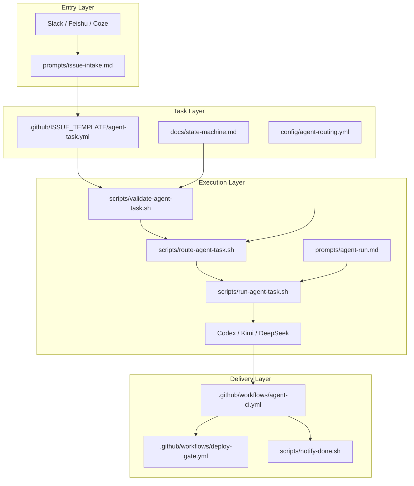
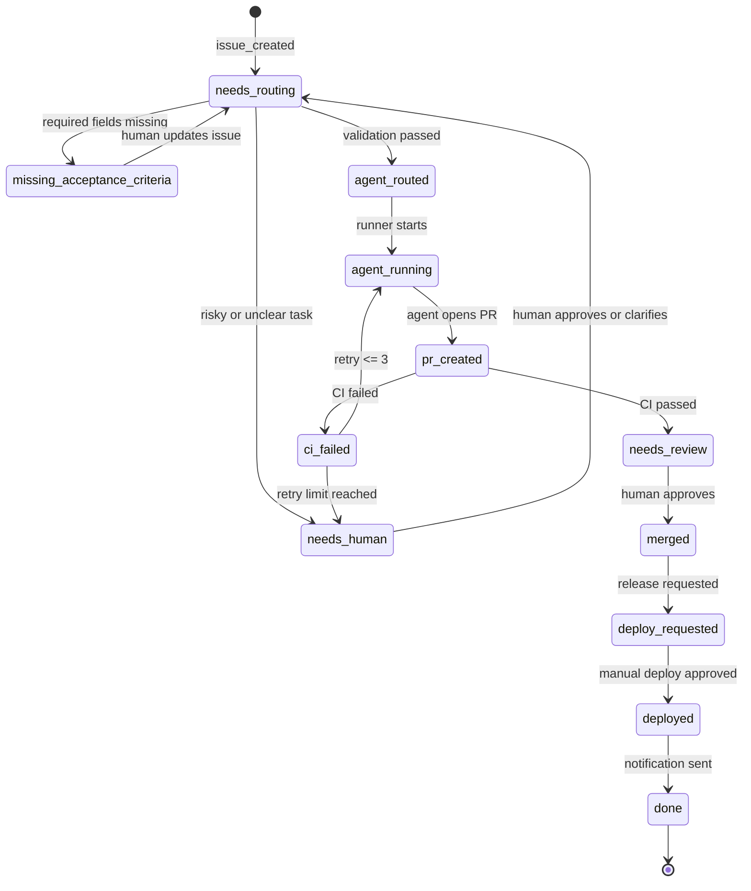
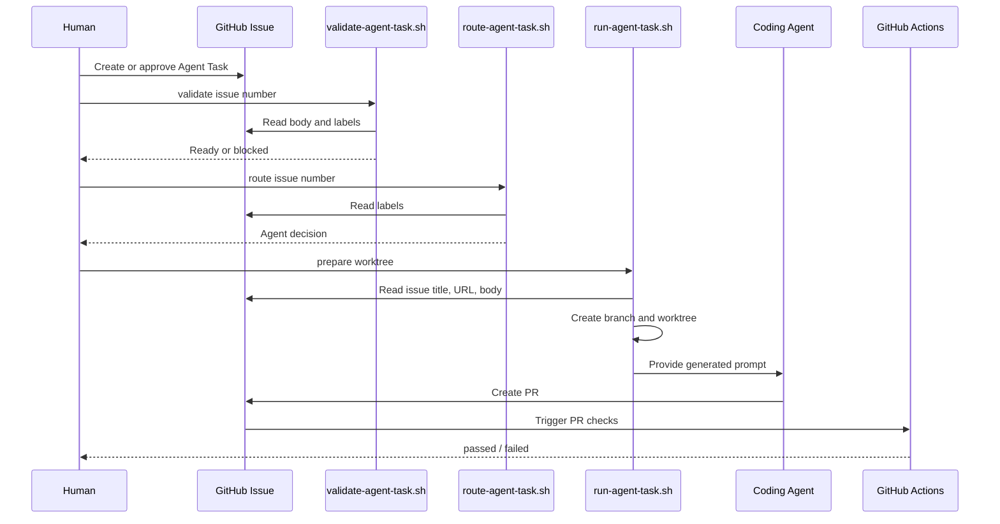
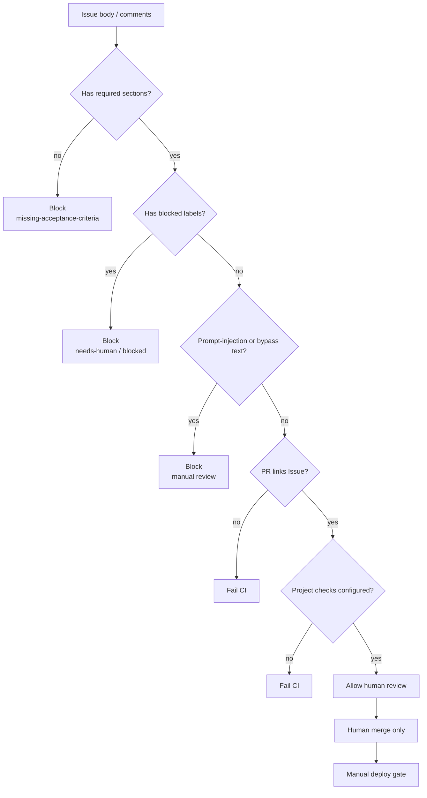

# AI Agent Workflow Architecture

这份架构图描述 `ai-agent-workflow` 如何把群聊需求变成可追踪、可验收、可交付的 agent 研发任务。

## Overall Architecture

```mermaid
flowchart LR
  User["Human requester"] --> Chat["Slack / Feishu / Coze"]
  Chat --> Intake["Intake bot<br/>prompts/issue-intake.md"]
  Intake --> Issue["GitHub Issue<br/>Agent Task template"]

  Issue --> Validate["Validate task<br/>scripts/validate-agent-task.sh"]
  Validate -->|ready| Route["Route task<br/>scripts/route-agent-task.sh"]
  Validate -->|blocked| Human["Human clarification"]

  Route --> Config["Routing config<br/>config/agent-routing.yml"]
  Config --> Runner["Agent runner<br/>scripts/run-agent-task.sh"]

  Runner --> Worktree["Isolated git worktree"]
  Worktree --> Agent["Coding agent<br/>Codex / Kimi / DeepSeek"]
  Agent --> PR["Pull Request"]

  PR --> CI["Agent CI<br/>.github/workflows/agent-ci.yml"]
  CI -->|passed| Review["Human review"]
  CI -->|failed| Fix["Agent retry<br/>max 3 rounds"]
  Fix --> PR

  Review -->|approved| Merge["Human merge"]
  Merge --> DeployGate["Manual deploy gate<br/>deploy-gate.yml"]
  DeployGate --> Notify["Done notification<br/>scripts/notify-done.sh"]
  Notify --> Chat
```

## Component Boundaries

## State Flow

## Local Runner Sequence

## Security Gates

